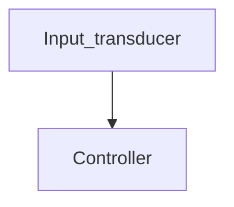

# 1.1 Introduction
[[Control System]] - an arrangement of components forming a system that will provide the desired response regardless of any external changes.

A control system consists of *subsystems* and *processes* (or *plants*) assembled for the purpose of obtaining a desired *output* with desired *performance*, given a specified *input*.

[[Plant]] (Process) - 

Four primary uses for control systems:
1. Power amplification
2. Remote control
3. Convenience of input form
4. Compensation for disturbances

# 1.3 System Configurations
## Open-Loop Systems
![[1.5a.png]]
Figure 1.5(a)

*[[Input Transducer]]* - converts the input into a form that can be used by the *controller*.
*[[Controller]]* - drives a *process* or a *plant*.
*Input* (*Cause*, or *Reference*) - 
